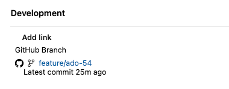
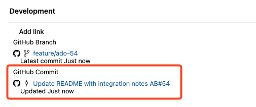
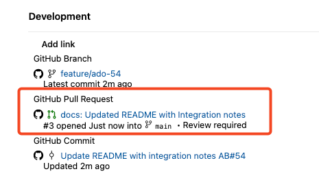
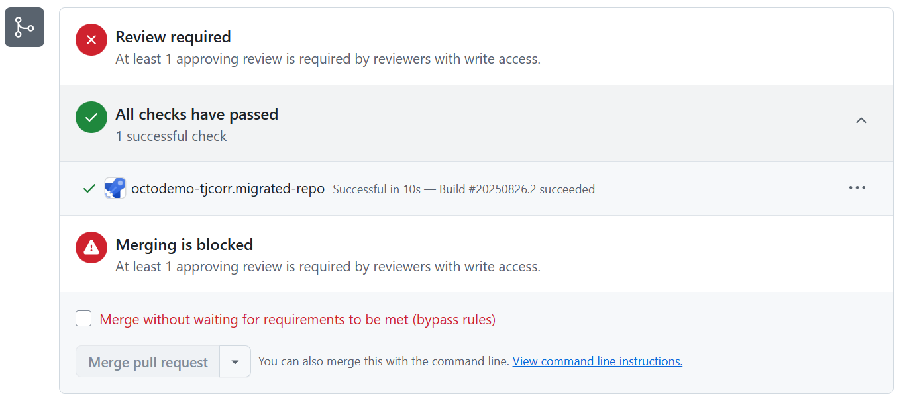

## Step 4: Integrate GitHub with Azure DevOps Boards and Pipelines

🎉 **Congratulations!** You've successfully migrated your repository from Azure DevOps to GitHub!

Now let's explore how to create a hybrid workflow by integrating your newly migrated GitHub repository with Azure DevOps Boards and Pipelines. This approach allows you to leverage the best of both platforms - GitHub's advanced AI features with Azure DevOps' project management and CI/CD capabilities.

### Integration Benefits

By connecting GitHub with Azure DevOps, you can:

- **Work Item Linking**: Link GitHub commits and pull requests to Azure DevOps work items
- **Automated Builds**: Trigger Azure Pipelines from GitHub repository changes
- **Cross-Platform Visibility**: View GitHub activity directly in Azure DevOps Boards
- **Unified Reporting**: Track development progress across both platforms

### ⌨️ Activity: Install Azure Boards GitHub App

First, let's set up the integration between your GitHub repository and Azure DevOps Boards using the Azure Boards GitHub App.

1. Install the Azure Boards GitHub App:
   - Go to the [Azure Boards GitHub App page](https://github.com/marketplace/azure-boards)
   - Select your GitHub organization `{{ github_org }}` under Account
   - Click **Install**
   - Select either `All repositories` or `Only select repositories`. If you choose the latter, you'll need to specify the `{{ github_org }}/{{ target_github_repo_name }}` GitHub repository.
   - Click **Install & Authorize**

> [!NOTE]
> If the Azure Boards app is already installed you will instead need to add your newly migrated repository to the list of approved repositories.
>
> You should do that within the [GitHub Apps organization settings](https://github.com/organizations/{{ github_org }}/settings/installations) of your `{{ github_org }}` GitHub organization.

2. You'll be redirected to Azure DevOps to complete the connection:
   - _(If required)_ Authenticate with the appropriate account
   - Select your Azure DevOps organization
   - Choose the project: `{{ ado_project_name }}`
   - Click **Continue**

<details>
<summary>Having trouble? 🤷</summary><br/>

- Make sure you have admin permissions on both the GitHub repository and Azure DevOps project
- If the Azure Boards app isn't showing up, check that it's properly installed in your organization's settings
- If you have many GitHub repositories you may be prompted to select the specific repository you want to connect to Azure Boards.

</details>

### ⌨️ Activity: Set Up Azure Pipelines GitHub Integration

Now let's integrate your GitHub repository with Azure Pipelines for continuous integration.

1. Install the Azure Pipelines GitHub App:
   - Go to the [Azure Pipelines GitHub App page](https://github.com/marketplace/azure-pipelines)
   - Select your GitHub organization `{{ github_org }}` under Account
   - Click **Install**
   - Select either `All repositories` or `Only select repositories`. If you choose the latter, you'll need to specify the `{{ github_org }}\{{ target_github_repo_name }}` GitHub repository.
   - Click **Install**

> [!NOTE]
> If the Azure Pipelines app is already installed you will instead need to add your newly migrated repository to the list of approved repositories.
>
> You should do that within the [GitHub Apps organization settings](https://github.com/organizations/{{ github_org }}/settings/installations) of your `{{ github_org }}` GitHub organization.

2. You'll be redirected to Azure DevOps to complete the connection:
   - _(If required)_ Authenticate with the appropriate account
   - Select your Azure DevOps organization
   - Choose the project: `{{ ado_project_name }}`
   - Click **Continue**
   - Select your repository: `{{ github_org }}/{{ target_github_repo_name }}`
   - Click **Run**

<details>
<summary>Having trouble? 🤷</summary><br/>

- Make sure you have admin permissions on both the GitHub repository and Azure DevOps project
- If the Azure Pipelines app isn't showing up, check that it's properly installed in your organization's settings
- If you are using a free Azure DevOps organization, ensure you have enough parallel jobs available for your builds. If your build fails due to `No hosted parallelism`, you can still proceed with the rest of the exercise.

</details>

### ⌨️ Activity: Explore Integration Features

Now that we have both Azure DevOps Pipelines and Azure Boards integrated with GitHub, let's demonstrate the full workflow and see how the integrations work together.

#### 🌿 Creating a Branch from a Work Item

1. Navigate to your work item in Azure DevOps: [{{ ado_url }}/{{ ado_project_name }}/_workitems]({{ ado_url }}/{{ ado_project_name }}/\_workitems)
1. Create a new work item and make note of the generated work item ID
1. Under the **Development** section on the right side of the page, Click the **Create a branch** link.
   > ❕ **Important:** Make sure to select a GitHub link rather than an Azure Repos link.
   1. Give your branch an informative name, such as `feature/ado-<workitem-id>`
   1. Select the GitHub repository from the dropdown: `{{ github_org }}/{{ target_github_repo_name }}`
   1. Choose the base branch: `main`
   1. Click **Create**
1. A new branch is created in your GitHub repository. You can navigate to it directly from the link in the work item.

   <details>
   <summary>📸 Show screenshot</summary><br/>

   

   </details>

#### 📝 Committing to your Branch

1. Create a simple change to the branch you created, such as updating the README file. This can be done in the GitHub UI by clicking the pencil icon to edit the file.
1. In your commit message, include `AB#<workitem-id>` to automatically link the commit to the work item.

   ```txt
   Update README with integration notes AB#<workitem-id>
   ```

   If you include `fixes` keyword, the work item will also be marked as `Done` when the commit gets merged to `main` branch.

   ```txt
   Update README with integration notes - fixes AB#<workitem-id>
   ```

1. If you return to the Azure DevOps work item, you'll see the commit is now linked in the Development section.

   <details>
   <summary>📸 Show screenshot</summary><br/>

   

   </details>

> [!TIP]
> You can also manually link commits to work items after the fact inside the ADO work item by selecting `Add Link` under the development section and selecting a GitHub commit.

#### 🔄 Creating a Pull Request

1. Inside your GitHub repository click on the **Pull requests** tab click the **Compare & pull request** button.

1. In your pull request description, include the Azure DevOps work item reference `AB#<workitem-id>` to automatically link the PR to the work item. Prefix it with the `Fixes` keyword to mark the work item as `Done` when the PR gets merged.

   ```txt
   This PR updates the README with integration notes

   Fixes AB#<workitem-id>
   ```

1. Click **Create pull request** and notice how the `AB#<workitem-id>` reference in the description automatically converts to a hyperlink.
1. If you return to the Azure DevOps work item, you will see the pull request is now linked in the Development section.

   <details>
   <summary>📸 Show screenshot</summary><br/>

   

   </details>

1. Notice that an Azure Pipelines build is triggered automatically on the PR. You can view the build status directly in the GitHub PR or click the build to be directed to the Azure Pipelines run.

   <details>
   <summary>📸 Show screenshot</summary><br/>

   

   </details>

1. Merge the Pull Request once the build has completed.

   > 🪧 **Note:** The PR will also require approval from at least one reviewer but as a repository admin you can bypass this functionality.

1. After the PR is merged, return to the Azure DevOps work item and observe the work item has been marked as `Done`.


<details>
<summary>Having trouble? 🤷</summary><br/>

- For the work item did to get marked as `Done` you need to use the `fixes AB#<work-item>` syntax in either (see [docs](https://learn.microsoft.com/azure/devops/boards/github/link-to-from-github?view=azure-devops#use-ab-to-link-from-github-to-azure-boards-work-items))
  - Commit message pushed to `main` branch
  - PR description merged to `main` branch

</details>


#### ✅ Complete the Exercise

With the integration successfully tested, add a comment to this issue to complete the exercise and get a review!

   ```md
   Hey @professortocat, I've successfully integrated GitHub and Azure DevOps!
   ```

### ⌨️ (_Optional_) Activity: Clean Up Resources

After completing the exercise, you may want to clean up the resources that were created during this lab. This step is optional but recommended for keeping your environments tidy.

<details>
<summary>🧹 Show cleanup steps</summary>

1. **Clean up Azure DevOps project**:

   ```bash
   cd ado/project
   terraform apply -destroy -var="ado_token=$ADO_PAT"
   ```

   You will be asked to confirm by writing `yes`.

1. **Delete the migrated GitHub repository**:

   - Navigate to the migrated repository on GitHub: https://github.com/{{ github_org }}/{{ target_github_repo_name }}
   - Go to repository `Settings` tab
   - Scroll down to the `Danger Zone` and click `Delete this repository`
   - Follow the prompts to confirm deletion

1. **Revoke GitHub migrator role**:

   ```bash
   gh ado2gh revoke-migrator-role --actor {{ login }} --actor-type USER --github-org {{ github_org }}
   ```

1. **Delete Azure DevOps Personal Access Token**:

   - Navigate to your Azure DevOps Organization
   - Find the token you created for this exercise and delete it

</details>
